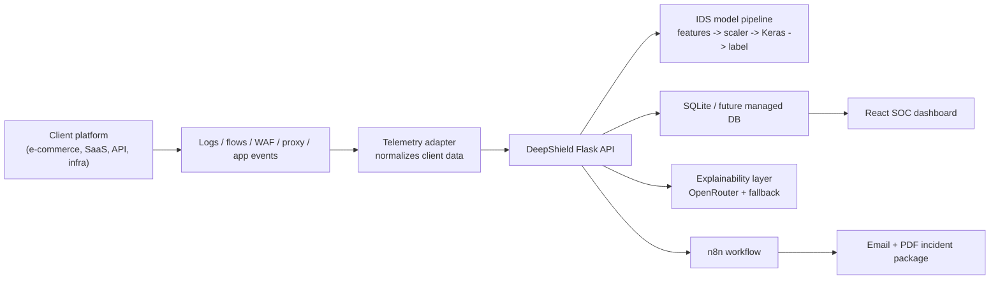

# DeepShield IDS

DeepShield is a prototype Security Operations Center (SOC) and Intrusion Detection System (IDS) platform. It combines a Flask detection API, a React SOC dashboard, deep learning model artifacts, explainability, incident escalation, and n8n-based email/PDF automation.

The current project is built for simulation and presentation. It is not yet a drop-in production IDS for a real client network. The production path is clear, though: connect real application, infrastructure, WAF, proxy, firewall, or SIEM telemetry into the backend ingestion API, map those events into the model feature schema, and route validated alerts into the SOC workflow.

## Executive Summary

| Area | Status | Notes |
| --- | --- | --- |
| SOC dashboard | Working | Live alert queue, telemetry chart, investigation workspace, health panels |
| Backend API | Working | Flask API for event ingestion, prediction, alerts, reports, and automation |
| Attack simulator | Working | Controlled attack injection for demos and workflow validation |
| Unknown attack workflow | Working | Unknown signatures become Critical / high-urgency incidents |
| Email automation | Working when n8n is configured | Auto-escalates High/Critical incidents and sends PDF report package |
| Deep learning artifacts | Included | Keras model, scaler, feature names, and label encoder are stored in `NewApprochmodels/` |
| Production client integration | Planned | Requires telemetry adapter, feature mapping, deployment hardening, and validation |

## Architecture



## Repository Layout

| Path | Purpose |
| --- | --- |
| `deepshield_backend/` | Flask backend API, model service, alert routes, automation dispatch |
| `uii-main/` | React + Vite frontend SOC dashboard |
| `NewApprochmodels/` | Required model artifacts: Keras model, scaler, label encoder, feature names |
| `scripts/` | Local maintenance and diagnostics scripts |
| `docs/` | Deployment, model pipeline, and n8n setup documentation |
| `docs/n8n/` | n8n workflow JSON and setup guide |
| `launch_presentation.bat` | Windows one-click demo launcher |
| `launch_attack_control.bat` | Windows red-team attack injection launcher |
| `.env.example` | Safe environment template |

## Core Components

| Component | Technology | Responsibility |
| --- | --- | --- |
| Frontend | React, TypeScript, Vite, Tailwind | SOC dashboard, alert queue, telemetry chart, investigation panel |
| Backend | Python, Flask, SQLAlchemy | Ingest events, create alerts, apply escalation policy, expose APIs |
| Detection pipeline | TensorFlow/Keras, scikit-learn artifacts | Scale features, run IDS model, decode predicted class |
| Automation | n8n webhook pipeline | Send HTML/PDF incident packages by email |
| Explainability | OpenRouter LLM + fallback | Analyst summary, recommended actions, report narrative |
| Storage | SQLite for local demo | Alerts, traffic events, automation runs, incident events |

## Current Capabilities

- Real-time SOC dashboard with attack telemetry visualization.
- Alert queue with severity, confidence, source, target, and status.
- Investigation workspace with incident details and explainability.
- Unknown attack mode that marks the alert as Critical and high urgency.
- Automatic escalation for High and Critical alerts.
- Automatic n8n dispatch after escalation.
- PDF report generation for incident response.
- Attack simulator for known and unknown attack types.
- Health endpoints exposing model/runtime state.

## Important Production Note

DeepShield is currently a simulation-first prototype. In the demo, attacks are generated by `simulate_live_traffic.py` and posted into `/ingest/traffic-event`.

For real security use, a client platform must send real telemetry. That means DeepShield needs an integration layer that collects data from the client environment, converts it into the expected IDS feature format, and sends it to the backend. Without that integration layer, the platform is useful for demos, workflow validation, and UI/automation proof of concept, but not yet real network protection.

## How A Client Platform Would Connect

Example client: an e-commerce platform with web servers, APIs, login flows, payment routes, and infrastructure logs.

| Client Source | Example Data | DeepShield Integration Path |
| --- | --- | --- |
| Web application | login failures, suspicious sessions, checkout anomalies | Send application security events to DeepShield API |
| Reverse proxy / Nginx | IP, path, status code, user-agent, request rate | Build adapter that converts access logs into telemetry events |
| WAF / CDN | blocked requests, SQLi/XSS signatures, bot scores | Forward WAF events into `/ingest/traffic-event` |
| Cloud logs | VPC flow logs, load balancer logs, firewall logs | Normalize logs into flow-like features |
| Authentication system | failed login bursts, impossible travel, token abuse | Create alert events for brute force and account takeover behavior |
| SIEM | correlated security events | Push enriched detections into DeepShield for SOC workflow |

### Integration Options

| Option | Best For | How It Works |
| --- | --- | --- |
| Direct API ingestion | Fast pilot integration | Client sends JSON events to DeepShield backend |
| Log forwarder | Infrastructure telemetry | Filebeat/Vector/Fluent Bit forwards logs to an adapter service |
| SIEM connector | Existing SOC teams | SIEM sends normalized events to DeepShield for visualization and reporting |
| WAF/CDN webhook | Web attack monitoring | WAF sends suspicious request events to DeepShield |
| Custom agent | Deeper endpoint/network visibility | Client installs an agent that extracts flow features |

## API Integration Contract

For the current simulator-level integration, send events to:

```http
POST /ingest/traffic-event
Content-Type: application/json
```

Example:

```json
{
  "attack_type": "Web Attack - Sql Injection",
  "confidence": 0.91,
  "source": "203.0.113.10",
  "target": "checkout-api",
  "protocol": "TCP",
  "dst_port": 443
}
```

This creates a traffic event. If the event is not benign, the backend creates an alert, applies severity rules, escalates High/Critical alerts, and can dispatch an n8n email/PDF report.

For full model-based prediction, use:

```http
POST /predict
Content-Type: application/json
```

That path requires a complete feature vector matching `NewApprochmodels/feature_names.pkl`.

## Model Pipeline

DeepShield uses four model artifacts together:

| Artifact | Role |
| --- | --- |
| `feature_names.pkl` | Defines the exact feature order expected by the model |
| `scaler.pkl` | Applies the same numeric scaling used during training |
| `deepshield_ids_model.keras` | Performs neural network inference |
| `label_encoder.pkl` | Converts model output index into attack label |

Detailed explanation: `docs/MODEL_PIPELINE_REPORT.md`.

## Local Setup

### Requirements

| Tool | Recommended |
| --- | --- |
| Python | 3.11 for TensorFlow compatibility |
| Node.js | LTS version |
| npm | Bundled with Node.js |
| n8n | Local or hosted instance for automation |

### Environment

Copy the example file:

```bash
copy .env.example .env
```

Set these values:

| Variable | Purpose |
| --- | --- |
| `OPENROUTER_API_KEY` | Enables LLM explainability |
| `IDS_N8N_WEBHOOK_URL` | n8n production webhook URL |
| `IDS_N8N_WEBHOOK_SECRET` | Shared secret used by backend and n8n workflow |
| `MODEL_DIR` | Path to model artifacts |

Never commit `.env`. It is intentionally ignored.

## Running Locally

### Windows one-click demo

```bat
launch_presentation.bat
```

Then open the attack console:

```bat
launch_attack_control.bat
```

Use option `15` to trigger the unknown Critical attack demo.

### Manual backend

```bash
python -m venv .venv
.venv\Scripts\python.exe -m pip install -r deepshield_backend\requirements.txt
cd deepshield_backend
..\.venv\Scripts\python.exe run.py
```

If running on Windows PowerShell, use:

```powershell
.\.venv\Scripts\python.exe deepshield_backend\run.py
```

### Manual frontend

```bash
cd uii-main
npm install
npm run dev
```

Default URLs:

| Service | URL |
| --- | --- |
| Frontend | `http://localhost:3000` |
| Backend API | `http://127.0.0.1:5000` |
| n8n | `http://localhost:5678` |

## n8n Email Automation

Import:

```text
docs/n8n/deepshield_escalation_workflow.json
```

Then configure:

| Item | Required Action |
| --- | --- |
| Webhook URL | Set `IDS_N8N_WEBHOOK_URL` in `.env` |
| Shared secret | Match `IDS_N8N_WEBHOOK_SECRET` with the workflow Code node |
| SMTP credentials | Configure the Send Email node in n8n |
| Recipient | Set `DEEPSHIELD_ANALYST_EMAIL` in n8n environment |
| Sender | Set `DEEPSHIELD_FROM_EMAIL` in n8n environment |

More details: `docs/n8n/SETUP.md`.

## Testing The Automation

1. Start n8n and activate the workflow.
2. Start DeepShield backend after `.env` changes.
3. Trigger an unknown attack:

```bash
python deepshield_backend/simulate_live_traffic.py --mode attack --attack-type "Unknown Zero-Day Exploit Chain" --burst-size 1 --cycles 1
```

Expected result:

- Alert is created.
- Severity becomes `Critical`.
- Status becomes `escalated`.
- Automation run is queued.
- n8n receives webhook.
- Email is sent with PDF attachment.

Check automation runs:

```http
GET /automation/incidents/{alert_id}/runs
```

## Production Roadmap

| Phase | Goal | Work Required |
| --- | --- | --- |
| 1. Pilot | Connect one real app or service | Build a telemetry adapter for logs/events |
| 2. Feature mapping | Use the ML model on real data | Map client telemetry to `feature_names.pkl` schema |
| 3. Validation | Reduce false positives | Test against historical incidents and benign traffic |
| 4. SOC workflow | Operationalize alerts | Define escalation rules, owners, SLAs, and runbooks |
| 5. Hardening | Deploy safely | Auth, RBAC, TLS, managed database, audit logs, backups |
| 6. Client rollout | Real monitoring | Deploy collectors/connectors and tune rules per client |

## Security Work Still Needed

Before using DeepShield for a real client, add:

- Authentication and role-based access control for the dashboard.
- API keys or mTLS for ingestion endpoints.
- HTTPS/TLS everywhere.
- Managed database instead of local SQLite.
- Structured audit logging.
- Tenant separation if serving multiple clients.
- Input validation and rate limiting on public endpoints.
- Secure secret management instead of local `.env` in production.
- Real telemetry adapters for the target client environment.
- Model evaluation against the client's traffic distribution.

## Deployment

Google Cloud deployment notes are in:

```text
docs/GCP_DEPLOYMENT.md
```

The repository includes:

| File | Purpose |
| --- | --- |
| `cloudbuild.yaml` | Cloud Build pipeline |
| `deepshield_backend/Dockerfile` | Backend container |
| `uii-main/Dockerfile` | Frontend container |
| `uii-main/nginx.conf.template` | Runtime API proxy configuration |

## Git Hygiene

The repo keeps source and required model artifacts, while ignoring local/runtime files:

| Ignored | Reason |
| --- | --- |
| `.env` | Secrets |
| `.venv/` | Local Python environment |
| `node_modules/` | Reinstallable frontend dependencies |
| `dist/` | Build output |
| `*.db` | Local database |
| `__pycache__/` | Python cache |

## License

No license has been selected yet. Add a license before public production use.
