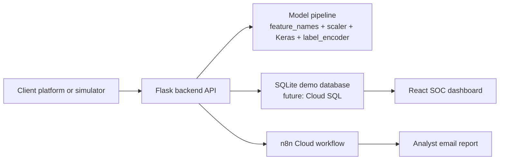

# DeepShield IDS

DeepShield is a cloud-ready Intrusion Detection System prototype that combines a deep learning detection backend, a SOC dashboard, incident escalation logic, and n8n email automation.

The repository is prepared as a deliverable application repository. It contains the runnable platform source, model artifacts, Docker files, Cloud Build pipeline, Kubernetes manifests, and the n8n workflow export. Local report folders, ZIP archives, notebooks, Markdown drafts, and Windows BAT demo launchers are intentionally excluded from Git.

## Live Deployment

| Service | URL |
| --- | --- |
| SOC dashboard | `http://34.9.156.189` |
| Backend API | `http://34.71.170.238:8080` |
| Health endpoint | `http://34.71.170.238:8080/health` |
| n8n webhook | `https://mahdigh.app.n8n.cloud/webhook/deepshield-report` |

The public IPs are Kubernetes `LoadBalancer` addresses and may change if the services are recreated.

## What DeepShield Does

| Capability | Description |
| --- | --- |
| Deep learning IDS | Loads a trained Keras model and preprocessing artifacts to classify network-flow events. |
| SOC dashboard | Displays live telemetry, alert queue, incident details, model health, automation status, and traffic taxonomy. |
| Alert escalation | Maps model/simulator events into severity, status, investigation evidence, and response actions. |
| Unknown attack workflow | Treats unknown attack signatures as Critical/high-urgency incidents. |
| Email automation | Sends escalated incident payloads to n8n for analyst email reporting. |
| Cloud deployment | Runs backend and frontend on Google Kubernetes Engine using Docker, Artifact Registry, and Cloud Build. |

## Architecture



## Repository Structure

| Path | Purpose |
| --- | --- |
| `deepshield_backend/` | Flask backend, API routes, model inference, alert logic, automation dispatch. |
| `uii-main/` | React, TypeScript, Vite SOC dashboard. |
| `NewApprochmodels/` | Required model artifacts used at runtime. |
| `k8s/` | Kubernetes namespace, backend, frontend, config map, and secret example manifests. |
| `cloudbuild-gke.yaml` | Cloud Build pipeline for building, pushing, and deploying to GKE. |
| `cloudbuild.yaml` | Cloud Build pipeline for container builds. |
| `docs/n8n/deepshield_escalation_workflow.json` | n8n workflow export for email escalation. |
| `.env.example` | Safe environment variable template. |

## Model Runtime Artifacts

The backend uses all four artifacts together:

| Artifact | Role |
| --- | --- |
| `NewApprochmodels/feature_names.pkl` | Defines the expected feature names and ordering. |
| `NewApprochmodels/scaler.pkl` | Applies the same scaling used during training. |
| `NewApprochmodels/deepshield_ids_model.keras` | Runs TensorFlow/Keras inference. |
| `NewApprochmodels/label_encoder.pkl` | Converts predicted class IDs into readable labels. |

## Backend API

| Endpoint | Purpose |
| --- | --- |
| `GET /health` | Checks backend and model runtime health. |
| `GET /ops/posture` | Returns SOC posture, model status, automation state, and recent activity. |
| `POST /predict` | Runs model inference on a full feature vector. |
| `POST /ingest/traffic-event` | Ingests simulator or integration events and creates alerts. |
| `GET /alerts` | Returns alert queue data for the SOC dashboard. |
| `GET /traffic/recent` | Returns recent telemetry points for the chart. |

Example event ingestion:

```json
{
  "attack_type": "Unknown Zero-Day Exploit Chain",
  "confidence": 0.97,
  "source": "attack-simulator",
  "target": "demo-victim-primary",
  "protocol": "DeepShield Stream",
  "dst_port": "ANY"
}
```

## Local Development

### Backend

```powershell
python -m venv .venv
.\.venv\Scripts\python.exe -m pip install -r deepshield_backend\requirements.txt
.\.venv\Scripts\python.exe deepshield_backend\run.py
```

Default backend URL:

```text
http://127.0.0.1:5000
```

### Frontend

```powershell
cd uii-main
npm install
npm run dev
```

Default frontend URL:

```text
http://localhost:3000
```

### Environment

Copy the safe template and fill local values:

```powershell
Copy-Item .env.example .env
```

Important variables:

| Variable | Purpose |
| --- | --- |
| `MODEL_DIR` | Path to the model artifact folder. |
| `IDS_N8N_WEBHOOK_URL` | n8n production webhook URL. |
| `IDS_N8N_WEBHOOK_SECRET` | Shared secret expected by the n8n workflow. |
| `OPENROUTER_API_KEY` | Optional explainability provider key. |
| `DATABASE_URL` | Database connection string. Defaults to SQLite for demo use. |

Do not commit `.env`.

## Docker Images

Backend:

```powershell
docker build -f deepshield_backend/Dockerfile -t deepshield-backend:local .
```

Frontend:

```powershell
docker build -f uii-main/Dockerfile -t deepshield-frontend:local ./uii-main
```

## GKE Deployment

The current GKE setup uses:

| Item | Value |
| --- | --- |
| GCP project | `deepshield-495313` |
| Region | `us-central1` |
| Zone | `us-central1-a` |
| Cluster | `deepshield-gke` |
| Artifact Registry repository | `deepshield` |
| Kubernetes namespace | `deepshield` |

Create the namespace and secret:

```powershell
kubectl apply -f k8s/namespace.yaml
kubectl apply -f k8s/backend-secret.yaml
```

Run the Cloud Build deployment:

```powershell
gcloud builds submit --config cloudbuild-gke.yaml --substitutions=_REGION=us-central1,_ZONE=us-central1-a,_CLUSTER=deepshield-gke,_REPOSITORY=deepshield,_API_BASE_URL=
```

Check rollout:

```powershell
kubectl rollout status deployment/deepshield-backend -n deepshield
kubectl rollout status deployment/deepshield-frontend -n deepshield
kubectl get svc -n deepshield
```

## n8n Automation

Import this workflow into n8n:

```text
docs/n8n/deepshield_escalation_workflow.json
```

Use this production webhook URL in the backend environment:

```text
https://mahdigh.app.n8n.cloud/webhook/deepshield-report
```

The workflow should validate the shared secret, format the incident payload, and send the analyst email using configured SMTP credentials.

## Production Readiness Notes

DeepShield is currently a strong prototype and presentation-ready SOC simulation. Before using it for real client protection, the following work is required:

| Area | Required Production Work |
| --- | --- |
| Telemetry | Connect real logs, WAF events, reverse proxy logs, firewall logs, VPC flow logs, or SIEM exports. |
| Feature mapping | Build an adapter that converts client telemetry into the expected model feature schema. |
| Database | Replace SQLite with Cloud SQL PostgreSQL or another managed database. |
| Security | Add HTTPS, authentication, role-based access control, API keys, and audit logging. |
| Secrets | Store production secrets in Google Secret Manager or Kubernetes secrets managed by CI/CD. |
| Model lifecycle | Add model versioning, drift detection, retraining, and rollback procedures. |
| SOAR | Extend n8n automation to create tickets, enrich IPs, notify teams, and trigger containment actions. |

## Git Hygiene

The repository intentionally ignores:

| Ignored Item | Reason |
| --- | --- |
| `.env` | Local secrets. |
| `.venv/`, `node_modules/`, `dist/` | Rebuildable dependencies and build output. |
| `*.db`, logs, caches | Runtime artifacts. |
| Report folders and ZIP archives | Academic/report packaging artifacts, not application source. |
| Extra Markdown drafts | Presentation/report working notes. |
| BAT files | Local Windows demo launchers, not portable deployment assets. |
| Notebooks and figure-generation scripts | Research/report material, not runtime application code. |

## License

No license has been selected yet.
