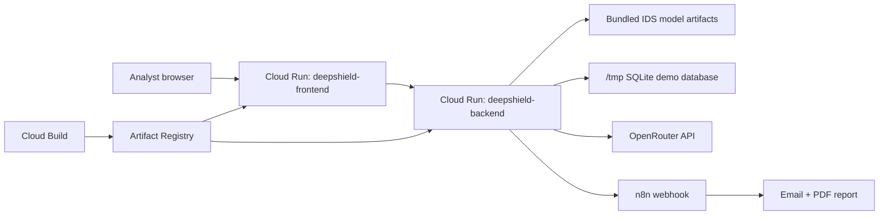

# DeepShield Cloud Run Deployment Guide

This guide prepares a complete Google Cloud Run environment for DeepShield IDS.

It deploys:

- `deepshield_backend` as a Flask/Gunicorn Cloud Run service.
- `uii-main` as a React/Vite static frontend served by Nginx on Cloud Run.
- IDS model artifacts bundled inside the backend image.
- Optional OpenRouter explainability through Secret Manager.
- Optional n8n email/PDF automation through a webhook URL and shared secret.

## 1. Deployment Architecture



## 2. Current Prototype Limits

Cloud Run deployment makes the project accessible and reproducible, but this is still an IDS prototype.

| Area | Current Cloud Run Setup | Production Upgrade Later |
| --- | --- | --- |
| Database | SQLite in `/tmp` | Cloud SQL Postgres |
| Auth | Public demo services | IAM, Identity-Aware Proxy, or app auth |
| Secrets | Secret Manager recommended | Secret Manager required |
| Model | Bundled in image | Model registry / versioned artifact store |
| Real telemetry | Simulator/API input | Client telemetry adapters |
| n8n | External webhook | Hosted n8n / Cloud Run workflow service |

For your report/poster, say this is a **cloud-hosted operational prototype**, not a fully hardened production SOC.

## 3. Prerequisites

Install and prepare:

| Tool / Account | Required |
| --- | --- |
| Google Cloud account | Yes |
| Billing enabled | Yes |
| Google Cloud CLI | Yes |
| GitHub repo pushed | Yes |
| Node/Python locally | Optional for local testing |
| n8n | Optional for email automation |
| OpenRouter API key | Optional for LLM explainability |

Check local `gcloud`:

```bash
gcloud --version
gcloud auth login
```

## 4. Choose Variables

Replace these values with your real project values.

```bash
export PROJECT_ID="your-gcp-project-id"
export REGION="us-central1"
export REPOSITORY="deepshield"
export BACKEND_SERVICE="deepshield-backend"
export FRONTEND_SERVICE="deepshield-frontend"
```

On Windows PowerShell:

```powershell
$PROJECT_ID="your-gcp-project-id"
$REGION="us-central1"
$REPOSITORY="deepshield"
$BACKEND_SERVICE="deepshield-backend"
$FRONTEND_SERVICE="deepshield-frontend"
```

## 5. Configure GCP Project

```bash
gcloud config set project $PROJECT_ID
```

PowerShell:

```powershell
gcloud config set project $PROJECT_ID
```

Enable required APIs:

```bash
gcloud services enable \
  run.googleapis.com \
  cloudbuild.googleapis.com \
  artifactregistry.googleapis.com \
  secretmanager.googleapis.com \
  logging.googleapis.com
```

PowerShell:

```powershell
gcloud services enable run.googleapis.com cloudbuild.googleapis.com artifactregistry.googleapis.com secretmanager.googleapis.com logging.googleapis.com
```

## 6. Create Artifact Registry Repository

```bash
gcloud artifacts repositories create $REPOSITORY \
  --repository-format=docker \
  --location=$REGION \
  --description="DeepShield container images"
```

PowerShell:

```powershell
gcloud artifacts repositories create $REPOSITORY --repository-format=docker --location=$REGION --description="DeepShield container images"
```

If it already exists, this command may fail with `ALREADY_EXISTS`; that is fine.

## 7. Create Secrets

Do not put real keys into GitHub. Store them in Secret Manager.

### Flask Secret

```bash
printf "replace-with-a-long-random-secret" | gcloud secrets create deepshield-flask-secret --data-file=-
```

PowerShell:

```powershell
"replace-with-a-long-random-secret" | gcloud secrets create deepshield-flask-secret --data-file=-
```

### OpenRouter API Key

```bash
printf "your-openrouter-api-key" | gcloud secrets create deepshield-openrouter-key --data-file=-
```

PowerShell:

```powershell
"your-openrouter-api-key" | gcloud secrets create deepshield-openrouter-key --data-file=-
```

### n8n Webhook Secret

```bash
printf "your-shared-n8n-secret" | gcloud secrets create deepshield-n8n-secret --data-file=-
```

PowerShell:

```powershell
"your-shared-n8n-secret" | gcloud secrets create deepshield-n8n-secret --data-file=-
```

If a secret already exists and you want to update it:

```bash
printf "new-value" | gcloud secrets versions add SECRET_NAME --data-file=-
```

PowerShell:

```powershell
"new-value" | gcloud secrets versions add SECRET_NAME --data-file=-
```

## 8. Grant Cloud Run Access To Secrets

Find your project number:

```bash
gcloud projects describe $PROJECT_ID --format="value(projectNumber)"
```

Cloud Run usually uses the Compute Engine default service account unless you configure a custom one:

```text
PROJECT_NUMBER-compute@developer.gserviceaccount.com
```

Grant access:

```bash
gcloud secrets add-iam-policy-binding deepshield-flask-secret \
  --member="serviceAccount:PROJECT_NUMBER-compute@developer.gserviceaccount.com" \
  --role="roles/secretmanager.secretAccessor"

gcloud secrets add-iam-policy-binding deepshield-openrouter-key \
  --member="serviceAccount:PROJECT_NUMBER-compute@developer.gserviceaccount.com" \
  --role="roles/secretmanager.secretAccessor"

gcloud secrets add-iam-policy-binding deepshield-n8n-secret \
  --member="serviceAccount:PROJECT_NUMBER-compute@developer.gserviceaccount.com" \
  --role="roles/secretmanager.secretAccessor"
```

Replace `PROJECT_NUMBER` with the real number.

## 9. Cloud Build Permissions

Cloud Build must deploy Cloud Run and push images.

Get the Cloud Build service account:

```bash
gcloud projects describe $PROJECT_ID --format="value(projectNumber)"
```

It is usually:

```text
PROJECT_NUMBER@cloudbuild.gserviceaccount.com
```

Grant permissions:

```bash
gcloud projects add-iam-policy-binding $PROJECT_ID \
  --member="serviceAccount:PROJECT_NUMBER@cloudbuild.gserviceaccount.com" \
  --role="roles/run.admin"

gcloud projects add-iam-policy-binding $PROJECT_ID \
  --member="serviceAccount:PROJECT_NUMBER@cloudbuild.gserviceaccount.com" \
  --role="roles/artifactregistry.writer"

gcloud projects add-iam-policy-binding $PROJECT_ID \
  --member="serviceAccount:PROJECT_NUMBER@cloudbuild.gserviceaccount.com" \
  --role="roles/iam.serviceAccountUser"
```

## 10. Backend Environment Variables

Backend Cloud Run runtime values:

| Variable | Cloud Run Value |
| --- | --- |
| `FLASK_DEBUG` | `0` |
| `IDS_HOST` | `0.0.0.0` |
| `IDS_PORT` | `8080` |
| `PORT` | `8080` |
| `DATABASE_URL` | `sqlite:////tmp/deepshield.db` |
| `MODEL_DIR` | `/app/NewApprochmodels` |
| `OPENROUTER_MODEL` | `openai/gpt-4o-mini` |
| `IDS_AUTO_DISPATCH_ON_ESCALATION` | `1` |
| `IDS_AUTO_DISPATCH_FORMAT` | `html` |
| `IDS_EMAIL_DISPATCH_SHORT_BODY_WITH_ATTACHMENTS` | `1` |

For the first demo deployment, use:

```text
IDS_CORS_ORIGINS=*
```

For a cleaner final deployment, update it later to your frontend URL:

```text
IDS_CORS_ORIGINS=https://deepshield-frontend-xxxxx.a.run.app
```

## 11. Important n8n Cloud Note

Do not use this local URL in Cloud Run:

```text
http://localhost:5678/webhook/deepshield-report
```

Inside Cloud Run, `localhost` means the backend container itself, not your computer.

For cloud deployment, use one of these:

| n8n Location | Webhook URL |
| --- | --- |
| n8n Cloud | `https://YOUR_N8N_DOMAIN/webhook/deepshield-report` |
| VPS-hosted n8n | `https://YOUR_SERVER_DOMAIN/webhook/deepshield-report` |
| Local n8n for demo only | Use a tunnel such as ngrok/cloudflared and put the public HTTPS URL |

Example:

```text
IDS_N8N_WEBHOOK_URL=https://your-n8n-domain/webhook/deepshield-report
```

## 12. First Cloud Build Deployment

From the repository root:

```bash
gcloud builds submit \
  --config cloudbuild.yaml \
  --substitutions=_REGION=$REGION,_REPOSITORY=$REPOSITORY,_BACKEND_SERVICE=$BACKEND_SERVICE,_FRONTEND_SERVICE=$FRONTEND_SERVICE,_API_BASE_URL="",_BACKEND_ENV_VARS="FLASK_DEBUG=0,IDS_HOST=0.0.0.0,IDS_PORT=8080,PORT=8080,DATABASE_URL=sqlite:////tmp/deepshield.db,MODEL_DIR=/app/NewApprochmodels,IDS_CORS_ORIGINS=*,OPENROUTER_MODEL=openai/gpt-4o-mini,IDS_AUTO_DISPATCH_ON_ESCALATION=1,IDS_AUTO_DISPATCH_FORMAT=html,IDS_EMAIL_DISPATCH_SHORT_BODY_WITH_ATTACHMENTS=1,IDS_N8N_WEBHOOK_URL=https://YOUR_N8N_DOMAIN/webhook/deepshield-report",_FRONTEND_ENV_VARS=""
```

PowerShell version:

```powershell
gcloud builds submit `
  --config cloudbuild.yaml `
  --substitutions="_REGION=$REGION,_REPOSITORY=$REPOSITORY,_BACKEND_SERVICE=$BACKEND_SERVICE,_FRONTEND_SERVICE=$FRONTEND_SERVICE,_API_BASE_URL=,_BACKEND_ENV_VARS=FLASK_DEBUG=0,IDS_HOST=0.0.0.0,IDS_PORT=8080,PORT=8080,DATABASE_URL=sqlite:////tmp/deepshield.db,MODEL_DIR=/app/NewApprochmodels,IDS_CORS_ORIGINS=*,OPENROUTER_MODEL=openai/gpt-4o-mini,IDS_AUTO_DISPATCH_ON_ESCALATION=1,IDS_AUTO_DISPATCH_FORMAT=html,IDS_EMAIL_DISPATCH_SHORT_BODY_WITH_ATTACHMENTS=1,IDS_N8N_WEBHOOK_URL=https://YOUR_N8N_DOMAIN/webhook/deepshield-report,_FRONTEND_ENV_VARS="
```

This creates both Cloud Run services. The frontend may not yet know the backend URL; fix that in the second deployment pass.

## 13. Attach Secrets To Backend Service

After the backend service exists, attach secrets:

```bash
gcloud run services update $BACKEND_SERVICE \
  --region=$REGION \
  --set-secrets=FLASK_SECRET_KEY=deepshield-flask-secret:latest,OPENROUTER_API_KEY=deepshield-openrouter-key:latest,IDS_N8N_WEBHOOK_SECRET=deepshield-n8n-secret:latest
```

PowerShell:

```powershell
gcloud run services update $BACKEND_SERVICE --region=$REGION --set-secrets=FLASK_SECRET_KEY=deepshield-flask-secret:latest,OPENROUTER_API_KEY=deepshield-openrouter-key:latest,IDS_N8N_WEBHOOK_SECRET=deepshield-n8n-secret:latest
```

## 14. Get Service URLs

```bash
gcloud run services describe $BACKEND_SERVICE \
  --region=$REGION \
  --format="value(status.url)"

gcloud run services describe $FRONTEND_SERVICE \
  --region=$REGION \
  --format="value(status.url)"
```

Save:

```bash
export BACKEND_URL="https://deepshield-backend-xxxxx.a.run.app"
export FRONTEND_URL="https://deepshield-frontend-xxxxx.a.run.app"
```

PowerShell:

```powershell
$BACKEND_URL="https://deepshield-backend-xxxxx.a.run.app"
$FRONTEND_URL="https://deepshield-frontend-xxxxx.a.run.app"
```

## 15. Second Cloud Build Deployment With Frontend API URL

Rebuild the frontend with the real backend URL:

```bash
gcloud builds submit \
  --config cloudbuild.yaml \
  --substitutions=_REGION=$REGION,_REPOSITORY=$REPOSITORY,_BACKEND_SERVICE=$BACKEND_SERVICE,_FRONTEND_SERVICE=$FRONTEND_SERVICE,_API_BASE_URL=$BACKEND_URL,_BACKEND_ENV_VARS="FLASK_DEBUG=0,IDS_HOST=0.0.0.0,IDS_PORT=8080,PORT=8080,DATABASE_URL=sqlite:////tmp/deepshield.db,MODEL_DIR=/app/NewApprochmodels,IDS_CORS_ORIGINS=$FRONTEND_URL,OPENROUTER_MODEL=openai/gpt-4o-mini,IDS_AUTO_DISPATCH_ON_ESCALATION=1,IDS_AUTO_DISPATCH_FORMAT=html,IDS_EMAIL_DISPATCH_SHORT_BODY_WITH_ATTACHMENTS=1,IDS_N8N_WEBHOOK_URL=https://YOUR_N8N_DOMAIN/webhook/deepshield-report",_FRONTEND_ENV_VARS=""
```

PowerShell:

```powershell
gcloud builds submit `
  --config cloudbuild.yaml `
  --substitutions="_REGION=$REGION,_REPOSITORY=$REPOSITORY,_BACKEND_SERVICE=$BACKEND_SERVICE,_FRONTEND_SERVICE=$FRONTEND_SERVICE,_API_BASE_URL=$BACKEND_URL,_BACKEND_ENV_VARS=FLASK_DEBUG=0,IDS_HOST=0.0.0.0,IDS_PORT=8080,PORT=8080,DATABASE_URL=sqlite:////tmp/deepshield.db,MODEL_DIR=/app/NewApprochmodels,IDS_CORS_ORIGINS=$FRONTEND_URL,OPENROUTER_MODEL=openai/gpt-4o-mini,IDS_AUTO_DISPATCH_ON_ESCALATION=1,IDS_AUTO_DISPATCH_FORMAT=html,IDS_EMAIL_DISPATCH_SHORT_BODY_WITH_ATTACHMENTS=1,IDS_N8N_WEBHOOK_URL=https://YOUR_N8N_DOMAIN/webhook/deepshield-report,_FRONTEND_ENV_VARS="
```

Reattach secrets after redeploy if needed:

```bash
gcloud run services update $BACKEND_SERVICE \
  --region=$REGION \
  --set-secrets=FLASK_SECRET_KEY=deepshield-flask-secret:latest,OPENROUTER_API_KEY=deepshield-openrouter-key:latest,IDS_N8N_WEBHOOK_SECRET=deepshield-n8n-secret:latest
```

## 16. Validate Backend

Health check:

```bash
curl "$BACKEND_URL/health"
```

Expected:

```json
{
  "status": "healthy",
  "model_loaded": true,
  "timestamp": "..."
}
```

If `model_loaded` is false, check:

- `MODEL_DIR=/app/NewApprochmodels`
- backend container logs
- TensorFlow installation
- model artifact files in `NewApprochmodels/`

## 17. Validate Frontend

Open:

```text
https://YOUR_FRONTEND_URL
```

Expected:

- Dashboard loads.
- Backend status appears.
- Alert queue loads.
- Telemetry area renders without a white chart background.

## 18. Trigger A Cloud Test Attack

Send a simulated unknown attack to the cloud backend:

```bash
curl -X POST "$BACKEND_URL/ingest/traffic-event" \
  -H "Content-Type: application/json" \
  -d '{
    "attack_type": "Unknown Zero-Day Exploit Chain",
    "confidence": 0.99,
    "source": "cloud-test-simulator",
    "target": "demo-victim-primary",
    "protocol": "TCP",
    "dst_port": 443
  }'
```

Expected response:

```json
{
  "status": "accepted",
  "escalation_reason": "auto-escalated: critical severity",
  "automation": {
    "status": "queued",
    "mode": "async"
  }
}
```

## 19. Check Automation Run

Get the latest alerts:

```bash
curl "$BACKEND_URL/alerts?limit=5"
```

Then check a specific alert:

```bash
curl "$BACKEND_URL/automation/incidents/ALERT_ID/runs"
```

Expected:

| Status | Meaning |
| --- | --- |
| `queued` | Backend queued the n8n dispatch |
| `delivered` | n8n accepted and processed the payload |
| `failed` | Check n8n URL, secret, SMTP, or Cloud Run logs |
| `skipped` | Anti-spam or severity policy blocked dispatch |

## 20. View Logs

Backend logs:

```bash
gcloud run services logs read $BACKEND_SERVICE --region=$REGION --limit=100
```

Frontend logs:

```bash
gcloud run services logs read $FRONTEND_SERVICE --region=$REGION --limit=100
```

Cloud Build logs:

```bash
gcloud builds list --limit=5
gcloud builds log BUILD_ID
```

## 21. Common Problems

| Problem | Likely Cause | Fix |
| --- | --- | --- |
| Frontend cannot reach backend | Wrong `VITE_API_BASE` | Rebuild frontend with backend URL |
| CORS error | `IDS_CORS_ORIGINS` wrong | Set it to frontend Cloud Run URL |
| n8n dispatch fails | Cloud Run cannot use local `localhost` n8n | Use public HTTPS n8n webhook |
| n8n rejects payload | Secret mismatch | Match `IDS_N8N_WEBHOOK_SECRET` and workflow Code node |
| Email not sent | SMTP node not configured | Configure n8n SMTP credentials |
| `model_loaded=false` | TensorFlow/model artifact path issue | Check logs and `MODEL_DIR` |
| Data disappears after restart | SQLite in `/tmp` is ephemeral | Use Cloud SQL later |

## 22. Report / Poster Wording

Use this wording:

> DeepShield was deployed to Google Cloud Run as a cloud-hosted IDS/SOC prototype. The deployment demonstrates containerization, cloud reproducibility, dashboard accessibility, backend inference readiness, alert escalation, and automated incident reporting through n8n. The current version uses simulated telemetry and an ephemeral SQLite database; future production work includes secure telemetry adapters, Cloud SQL, RBAC, tenant isolation, and validation against real client traffic.

## 23. Final Deployment Checklist

| Check | Done |
| --- | --- |
| GCP billing enabled |  |
| APIs enabled |  |
| Artifact Registry repo created |  |
| Secrets created |  |
| Cloud Build permissions granted |  |
| Backend deployed |  |
| Frontend deployed |  |
| Backend secrets attached |  |
| Frontend rebuilt with backend URL |  |
| Backend health endpoint works |  |
| UI loads from Cloud Run URL |  |
| Test attack creates Critical alert |  |
| n8n dispatch delivers email/PDF |  |

