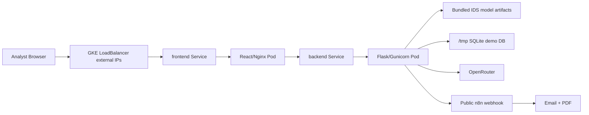

# DeepShield GKE Deployment Guide

This guide deploys DeepShield IDS on Google Kubernetes Engine (GKE).

Use GKE if you want to present the project as a more advanced cloud-native SOC platform with Kubernetes, pods, services, secrets, and scalable deployments. For the current prototype, this is more complex than Cloud Run, but it is valid and professional for a GCP + Kubernetes deployment story.

## 1. Target Architecture



## 2. Files Added For GKE

| File | Purpose |
| --- | --- |
| `k8s/namespace.yaml` | Creates `deepshield` namespace |
| `k8s/backend-configmap.yaml` | Non-secret backend environment values |
| `k8s/backend-secret.example.yaml` | Secret template for API keys/webhook secrets |
| `k8s/backend-deployment.yaml` | Backend Deployment + LoadBalancer Service |
| `k8s/frontend-deployment.yaml` | Frontend Deployment + LoadBalancer Service |
| `k8s/kustomization.yaml` | Kustomize entrypoint |

## 3. Prerequisites

Install:

- Google Cloud CLI
- `kubectl`
- Docker
- A GCP project with billing enabled

Login:

```bash
gcloud auth login
```

Set variables:

```bash
export PROJECT_ID="your-gcp-project-id"
export REGION="us-central1"
export ZONE="us-central1-a"
export CLUSTER_NAME="deepshield-gke"
export REPOSITORY="deepshield"
```

PowerShell:

```powershell
$PROJECT_ID="your-gcp-project-id"
$REGION="us-central1"
$ZONE="us-central1-a"
$CLUSTER_NAME="deepshield-gke"
$REPOSITORY="deepshield"
```

Set project:

```bash
gcloud config set project $PROJECT_ID
```

PowerShell:

```powershell
gcloud config set project $PROJECT_ID
```

## 4. Enable GCP APIs

```bash
gcloud services enable container.googleapis.com artifactregistry.googleapis.com cloudbuild.googleapis.com secretmanager.googleapis.com logging.googleapis.com
```

## 5. Create Artifact Registry

```bash
gcloud artifacts repositories create $REPOSITORY \
  --repository-format=docker \
  --location=$REGION \
  --description="DeepShield Docker images"
```

PowerShell:

```powershell
gcloud artifacts repositories create $REPOSITORY --repository-format=docker --location=$REGION --description="DeepShield Docker images"
```

If it already exists, continue.

Authenticate Docker:

```bash
gcloud auth configure-docker ${REGION}-docker.pkg.dev
```

PowerShell:

```powershell
gcloud auth configure-docker "$REGION-docker.pkg.dev"
```

## 6. Build And Push Docker Images

From repo root:

```bash
docker build -f deepshield_backend/Dockerfile \
  -t ${REGION}-docker.pkg.dev/${PROJECT_ID}/${REPOSITORY}/backend:latest \
  .

docker build -f uii-main/Dockerfile \
  --build-arg VITE_API_BASE="" \
  -t ${REGION}-docker.pkg.dev/${PROJECT_ID}/${REPOSITORY}/frontend:latest \
  .

docker push ${REGION}-docker.pkg.dev/${PROJECT_ID}/${REPOSITORY}/backend:latest
docker push ${REGION}-docker.pkg.dev/${PROJECT_ID}/${REPOSITORY}/frontend:latest
```

PowerShell:

```powershell
docker build -f deepshield_backend/Dockerfile -t "$REGION-docker.pkg.dev/$PROJECT_ID/$REPOSITORY/backend:latest" .
docker build -f uii-main/Dockerfile --build-arg VITE_API_BASE="" -t "$REGION-docker.pkg.dev/$PROJECT_ID/$REPOSITORY/frontend:latest" .
docker push "$REGION-docker.pkg.dev/$PROJECT_ID/$REPOSITORY/backend:latest"
docker push "$REGION-docker.pkg.dev/$PROJECT_ID/$REPOSITORY/frontend:latest"
```

Alternative after the cluster is created: use `cloudbuild-gke.yaml` to build, push, and roll out both deployments:

```bash
gcloud builds submit \
  --config cloudbuild-gke.yaml \
  --substitutions=_REGION=$REGION,_ZONE=$ZONE,_CLUSTER=$CLUSTER_NAME,_REPOSITORY=$REPOSITORY,_API_BASE_URL=http://BACKEND_EXTERNAL_IP:8080
```

Only use this after `k8s/backend-secret.yaml` has been applied once, because the backend pod requires `deepshield-backend-secrets`.

## 7. Create GKE Cluster

For a presentation/demo cluster:

```bash
gcloud container clusters create $CLUSTER_NAME \
  --zone=$ZONE \
  --num-nodes=2 \
  --machine-type=e2-standard-2 \
  --enable-ip-alias \
  --release-channel=regular
```

PowerShell:

```powershell
gcloud container clusters create $CLUSTER_NAME --zone=$ZONE --num-nodes=2 --machine-type=e2-standard-2 --enable-ip-alias --release-channel=regular
```

Get credentials:

```bash
gcloud container clusters get-credentials $CLUSTER_NAME --zone=$ZONE
```

PowerShell:

```powershell
gcloud container clusters get-credentials $CLUSTER_NAME --zone=$ZONE
```

Check:

```bash
kubectl get nodes
```

## 8. Prepare Kubernetes Manifests

Replace `PROJECT_ID` inside Kubernetes deployment files:

```bash
sed -i "s/PROJECT_ID/${PROJECT_ID}/g" k8s/backend-deployment.yaml
sed -i "s/PROJECT_ID/${PROJECT_ID}/g" k8s/frontend-deployment.yaml
```

PowerShell:

```powershell
(Get-Content k8s/backend-deployment.yaml) -replace 'PROJECT_ID', $PROJECT_ID | Set-Content k8s/backend-deployment.yaml
(Get-Content k8s/frontend-deployment.yaml) -replace 'PROJECT_ID', $PROJECT_ID | Set-Content k8s/frontend-deployment.yaml
```

Edit `k8s/backend-configmap.yaml`:

```yaml
IDS_N8N_WEBHOOK_URL: "https://YOUR_PUBLIC_N8N_DOMAIN/webhook/deepshield-report"
```

Important: `http://localhost:5678/...` will not work from GKE. Use public HTTPS n8n.

## 9. Create Real Backend Secret

Copy the example:

```bash
cp k8s/backend-secret.example.yaml k8s/backend-secret.yaml
```

PowerShell:

```powershell
Copy-Item k8s/backend-secret.example.yaml k8s/backend-secret.yaml
```

Edit `k8s/backend-secret.yaml` and set:

```yaml
FLASK_SECRET_KEY: "your-real-flask-secret"
OPENROUTER_API_KEY: "your-openrouter-key"
IDS_N8N_WEBHOOK_SECRET: "same-secret-as-n8n-workflow"
```

Do not commit `k8s/backend-secret.yaml`.

## 10. Apply Kubernetes Resources

```bash
kubectl apply -f k8s/namespace.yaml
kubectl apply -f k8s/backend-configmap.yaml
kubectl apply -f k8s/backend-secret.yaml
kubectl apply -f k8s/backend-deployment.yaml
kubectl apply -f k8s/frontend-deployment.yaml
```

If you are using the `cloudbuild-gke.yaml` pipeline later, keep this first manual apply step for the namespace, config, and secret. After that, Cloud Build can update images and rollouts.

Check pods:

```bash
kubectl get pods -n deepshield
kubectl get svc -n deepshield
```

Wait until pods are `Running`.

## 11. Get Public Frontend URL

The frontend service is `LoadBalancer`.

```bash
kubectl get svc deepshield-frontend -n deepshield
```

Wait for `EXTERNAL-IP`.

Open:

```text
http://EXTERNAL-IP
```

## 12. Get Public Backend URL

The backend service is also `LoadBalancer` because this project does not use a custom public domain yet.

```bash
kubectl get svc deepshield-backend -n deepshield
```

Wait for `EXTERNAL-IP`.

Backend test URL:

```text
http://BACKEND_EXTERNAL_IP:8080/health
```

Test:

```bash
curl http://BACKEND_EXTERNAL_IP:8080/health
```

## 13. Important Frontend API Base Issue

The Vite frontend needs the backend URL at build time.

Get backend external IP and rebuild frontend:

```bash
docker build -f uii-main/Dockerfile \
  --build-arg VITE_API_BASE=http://BACKEND_EXTERNAL_IP:8080 \
  -t ${REGION}-docker.pkg.dev/${PROJECT_ID}/${REPOSITORY}/frontend:latest \
  .

docker push ${REGION}-docker.pkg.dev/${PROJECT_ID}/${REPOSITORY}/frontend:latest
kubectl rollout restart deployment/deepshield-frontend -n deepshield
```

Since there is no public domain, keep using the backend external IP.

## 14. Trigger A Test Attack

Use the backend external IP:

```bash
curl -X POST http://BACKEND_EXTERNAL_IP:8080/ingest/traffic-event \
  -H "Content-Type: application/json" \
  -d '{
    "attack_type": "Unknown Zero-Day Exploit Chain",
    "confidence": 0.99,
    "source": "gke-test-simulator",
    "target": "demo-victim-primary",
    "protocol": "TCP",
    "dst_port": 443
  }'
```

Expected:

```json
{
  "status": "accepted",
  "escalation_reason": "auto-escalated: critical severity",
  "automation": {
    "status": "queued"
  }
}
```

## 15. Check Logs

Backend:

```bash
kubectl logs deployment/deepshield-backend -n deepshield
```

Frontend:

```bash
kubectl logs deployment/deepshield-frontend -n deepshield
```

Describe pod:

```bash
kubectl describe pod POD_NAME -n deepshield
```

## 16. Scale Services

Scale frontend:

```bash
kubectl scale deployment deepshield-frontend --replicas=2 -n deepshield
```

Scale backend:

```bash
kubectl scale deployment deepshield-backend --replicas=2 -n deepshield
```

Warning: with SQLite in `/tmp`, multiple backend replicas will not share the same database. For real scaling, move to Cloud SQL.

## 17. Cleanup

Delete app resources:

```bash
kubectl delete namespace deepshield
```

Delete cluster:

```bash
gcloud container clusters delete $CLUSTER_NAME --zone=$ZONE
```

## 18. Report / Poster Wording

Use this wording:

> DeepShield was deployed on Google Kubernetes Engine to demonstrate a cloud-native SOC architecture using containerized frontend and backend services, Kubernetes Deployments, Services, ConfigMaps, Secrets, health probes, and scalable pods. The deployment proves that the IDS/SOC prototype can run in a managed Kubernetes environment. Current limitations include simulated telemetry, SQLite-based demo persistence, and the need for future telemetry adapters and production hardening.

## 19. Final Checklist

| Step | Done |
| --- | --- |
| GCP project selected |  |
| APIs enabled |  |
| Artifact Registry created |  |
| Docker images built |  |
| Docker images pushed |  |
| GKE cluster created |  |
| Kubernetes manifests updated with project id |  |
| Backend secret created locally |  |
| Namespace/config/deployments applied |  |
| Pods running |  |
| Frontend external IP available |  |
| Backend health works |  |
| Test attack creates alert |  |
| n8n automation tested |  |
